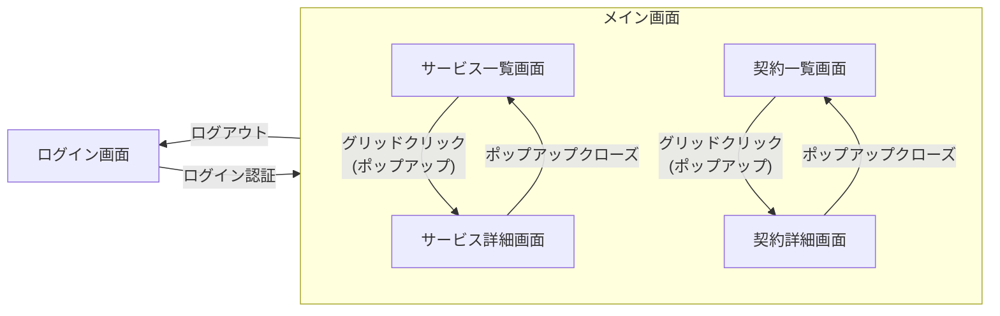

# 画面資産説明資料

## 基本構成と前提

### 前提技術

- **フレームワーク:** Angular
- **UIライブラリ:** Angular Material

### 画面の責務分離

本画面資産は、Angular Materialをベースに、画面固有のロジックとバックエンドAPIとの通信層(BFF)を分離して設計した。

## 画面構成と機能一覧

### メイン画面(`/`)

| 項目     | 詳細                                                                             |
| -------- | -------------------------------------------------------------------------------- |
| **構造** | ヘッダ、描画領域、フッタの3分割。                                                |
| **責務** | アプリケーション全体の統括、ログイン状態の保持、ルーティングによる画面切り替え。 |

### サイドメニュー

| 項目     | 詳細                                                                                  |
| -------- | ------------------------------------------------------------------------------------- |
| **表示** | メイン画面の左端に表示。                                                              |
| **機能** | サービス一覧画面(`/service-list`)と契約一覧画面(`/contract-list`)への遷移機能を提供。 |

### ログイン画面(`/login`)

| 項目     | 詳細                                                                       |
| -------- | -------------------------------------------------------------------------- |
| **機能** | メールアドレス、パスワードを入力し、認証サービスのログインメソッドを実行。 |
| **認証** | 認証エラーはラベル表示。ログイン成功後は、サービス一覧画面に遷移。         |

### サービス一覧画面(`/service-list`)

| 項目           | 詳細                                                                              |
| -------------- | --------------------------------------------------------------------------------- |
| **初期表示**   | 画面ロード時に検索キー無しで「サービス一覧API」を実行し、結果をグリッド表示。     |
| **検索機能**   | サービス名テキストボックスと検索ボタンを持ち、入力内容をキーに再検索を実行。      |
| **ページング** | APIレスポンスのページ情報(総ページ数、現在ページ等)をもとにページング処理を行う。 |
| **詳細表示**   | グリッドのレコードクリックで、IDをキーにサービス詳細画面をポップアップ表示。      |

### サービス詳細画面(ポップアップ)

| 項目         | 詳細                                                                                                               |
| ------------ | ------------------------------------------------------------------------------------------------------------------ |
| **初期表示** | 親コンポーネントから受け取ったIDをもとに「サービス詳細検索API」を実行し、結果を表示。                              |
| **注文機能** | 初期値1、最大値在庫数で注文数を入力する。                                                                          |
| **契約処理** | 契約ボタンを押下すると、サービスIDと注文数をキーに契約APIを実行する。                                              |
| **UI制御**   | 契約API実行中は契約ボタンを不活化し、APIの戻り(成功/失敗)に応じて再活性化を制御する。APIの返り(成功・失敗)をラベルで表示。 |

### 契約一覧画面(`contract-list`)

| 項目           | 詳細                                                                              |
| -------------- | --------------------------------------------------------------------------------- |
| **初期表示**   | 画面ロード時に検索キー無しで「契約一覧検索API」を実行し、結果をグリッド表示。     |
| **検索機能**   | サービス名テキストボックスと検索ボタンを持ち、入力内容をキーに再検索を実行。      |
| **ページング** | APIレスポンスのページ情報(総ページ数、現在ページ等)をもとにページング処理を行う。 |
| **詳細表示**   | グリッドのレコードクリックで、IDをキーに契約詳細画面をポップアップ表示。          |

### 契約詳細画面

| 項目         | 詳細                                                                                                                              |
| ------------ | --------------------------------------------------------------------------------------------------------------------------------- |
| **初期表示** | 親コンポーネントから受け取ったIDをもとに「契約詳細検索API」を実行し、結果を表示。                                                 |
| **解約処理** | 解約ボタンを押下すると、契約IDをキーに解約APIを実行する。                                                                         |
| **UI制御**   | 解約API実行中はボタンを不活化。API成功時は不活化のまま(再解約不可)、失敗時は再度活性化する。APIの返り(成功・失敗)をラベルで表示。 |

## 画面遷移

※サービス詳細ポップアップ内では契約の自画面遷移、契約詳細ポップアップ内では解約の自画面遷移が存在する。

## 画面バックエンド(BFF)とAPIの対応

画面からのリクエストを受け付け、バックエンドAPIにリクエストを送信する層(BFF)。APIからの戻り値を画面用に詰め直し、画面に渡す責務を持つ。

| ドメイン                 | BFFサービス                | 対応API                     | 機能                           |
| ------------------------ | -------------------------- | --------------------------- | ------------------------------ |
| **認証**                 | `auth.service.ts`          | ログインAPI                 | ユーザー認証とトークン発行     |
|                          |                            | トークンリフレッシュAPI     | アクセストークンの更新         |
|                          |                            | ログアウトAPI               | ログアウト処理                 |
| **ユーザー提供サービス** | `user-services.service.ts` | ユーザー提供サービス一覧API | サービスの一覧検索             |
|                          |                            | ユーザー提供サービス詳細API | 特定サービスの詳細取得         |
| **契約**                 | `contracts.service.ts`     | 契約一覧API                 | ログインユーザーの契約一覧検索 |
|                          |                            | 契約詳細API                 | 特定契約の詳細取得             |
|                          |                            | 契約API                     | サービスの契約(注文)実行       |
|                          |                            | 解約API                     | 契約の解約実行                 |

※システム内で定義されているサービスと、それを提供するユーザーとの関連性を示すため、APIとしては「ユーザー提供サービス」としている。画面上は、単に「サービス」と表現する。

## ディレクトリ構成

画面資産のディレクトリ構成を示す。

- **scms-frontend/src/app**
  - **bff (Backend For Frontend)**
    - **責務:** バックエンドAPIとの通信、トークン管理、DTOの変換。
    - **含まれるファイル:** `auth.service.ts`, `auth.interceptor.ts`, `contracts.service.ts`, `user-services.service.ts` など(対応するUTも含む)。
  - **models** APIのリクエスト・レスポンスと画面のDTO定義
    - **責務:** APIのリクエスト・レスポンス構造と画面のDTO定義。
    - **含まれるファイル:** `api.model.ts`(データ構造のみのため、対応するUTはスケルトンのみ実装)。
  - **pages**
    - **責務:** 画面テンプレート(HTML)、スタイル(SCSS)、画面制御ロジック(TS)を画面単位で定義。
    - **含まれるディレクトリ:** `login`, `main-page`, `service-list`, `service-detail`, `contract-list`, `contract-detail`。
  - **app.route.ts**
    - **責務:** 画面全体のルーティング。

## 画面の実装プロセス

画面実装は、下記の手順で行った。

1. あらかじめ上記のディレクトリ・ファイル構成を設計する。
1. 画面の概要をGeminiに解釈させ、ソースコードの雛形を作成させる。
1. 作成された雛形を手修正し、想定通りの動作をするように調整する。
